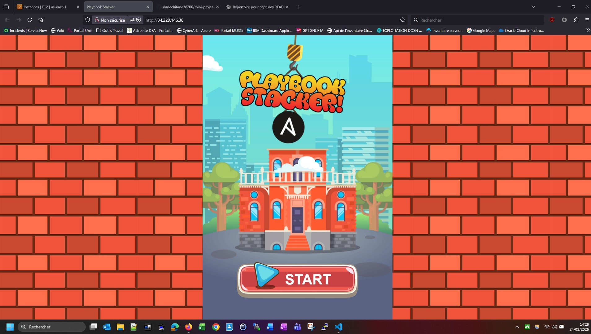

# Mini-Projet Ansible: Déploiement d'une Application

Ce projet consiste en deux étapes pour déployer une application à l'aide d'Ansible : une première étape de déploiement classique et une seconde étape de déploiement en conteneur utilisant Docker, avec le support d'un proxy Nginx en tant que rôle Ansible.

## Prérequis

- **Ansible** installé sur votre machine
- **Docker** installé pour la seconde partie du projet
- Accès à un environnement cible (serveur ou machine virtuelle) où l'application sera déployée

En pré-requis, j'ai construit un couple d'instances client-serveur EC2 (t3.micro + 10G de disque) avec les solutions ansible et docker déjà préinstallées (via user-data). 
Pour que le déploiement puisse s'effectuer sans erreur entre les 2 machine, une paire de clés a été générée sur le serveur (via la commande `ssh-keygen -t rsa`) puis déployé directement sur le client (via `ssh-copy-id`).

## Partie 1 : Déploiement de l'Application avec un Playbook Simple

### Étapes à suivre


La première étape a été de renseigner dans le fichier **hosts_vars/client1.yml**, l'adresse IP de la machine client:
`ansible_host: 172.31.20.69`
Ensuite de préciser le user ansible dans le fichier **group_vars/all.yml**:
`ansible_user: ubuntu`

Les autres paramètres des différents fichiers ainsi que le playbook n'ont pas a être modifié.


## Lancement du playbook effectué avec succès:

```bash

ubuntu@ip-172-31-17-216:~/mini-projet-ansible-commun/app-init$ ansible-playbook -i hosts nginx_playbook.yaml

PLAY [prod] **********************************************************************************************************

TASK [Gathering Facts] **********************************************************************************************************
ok: [client1]

TASK [Définir la variable nginx_root_location en fonction de la distribution] **********************************************************************************************************
skipping: [client1]

TASK [Définir la variable nginx_root_location pour Ubuntu] **********************************************************************************************************
ok: [client1]

TASK [Install EPEL] **********************************************************************************************************
skipping: [client1]

TASK [Install Nginx] **********************************************************************************************************
ok: [client1]

TASK [Restart nginx] **********************************************************************************************************
changed: [client1]

TASK [Template index.html-easter_egg.j2 to index.html on target] **********************************************************************************************************
ok: [client1]

TASK [Install unzip] **********************************************************************************************************
ok: [client1]

TASK [Unarchive playbook stacker game] **********************************************************************************************************
ok: [client1]

RUNNING HANDLER [Check HTTP Service] **********************************************************************************************************
ok: [client1]

PLAY RECAP **********************************************************************************************************
client1                    : ok=8    changed=1    unreachable=0    failed=0    skipped=2    rescued=0    ignored=0   
```


## Test URL de l'application OK

<p align="center">
  
</p>


## Partie 2 : Déploiement de l'Application en Conteneur avec Docker et Nginx en utilisant les rôles ansible

### Étapes à suivre

1. Naviguer dans le répertoire app-template du dépôt.
2. Compléter les fichiers de configuration :

    - Remplacez les expressions <FIX IT> par les valeurs appropriées dans les fichiers de rôle pour l'application et Nginx.
    - Assurez-vous que les configurations Ansible pour Docker et Nginx sont correctement définies.
    - Redigez entièrement le contenu du fichier webapp/task/main.yml afin de deployer l'application conteneuriser en utilisant le proxy nginx
      
3. Lancer le playbook pour déployer l'application

### Vérification

Partie 1 : L'application doit être accessible après le déploiement avec un simple playbook.

Partie 2 : L'application doit être accessible via un proxy Nginx dans un conteneur Docker après avoir complété les fichiers et lancé le playbook.
