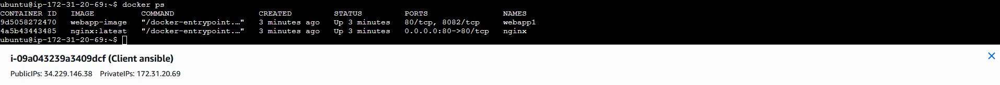
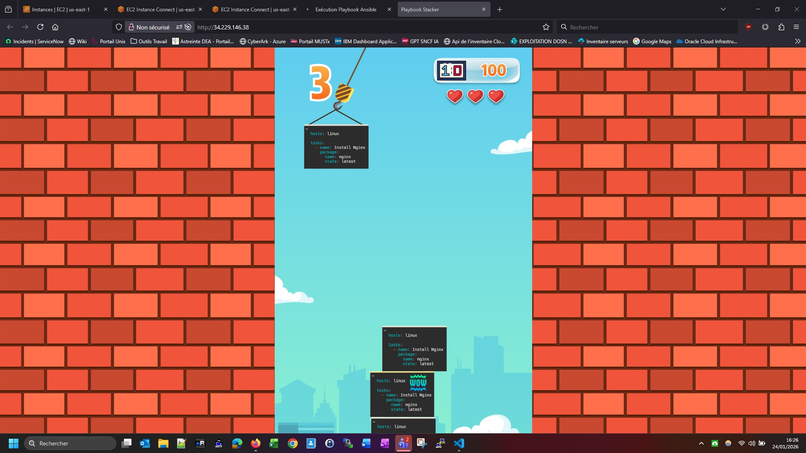

# Mini-Projet Ansible: Déploiement d'une Application

Ce projet consiste en deux étapes pour déployer une application à l'aide d'Ansible : une première étape de déploiement classique et une seconde étape de déploiement en conteneur utilisant Docker, avec le support d'un proxy Nginx en tant que rôle Ansible.

## Prérequis

En pré-requis, j'ai construit un couple d'instances client-serveur EC2 (t3.micro + 10G de disque) avec les solutions ansible et docker déjà préinstallées (via user-data). 
Pour que le déploiement puisse s'effectuer sans erreur entre les 2 machine, une paire de clés a été générée sur le serveur (via la commande `ssh-keygen -t rsa`) puis déployé directement sur le client (via `ssh-copy-id`).

## Partie 1 : Déploiement de l'Application avec un Playbook Simple

### Étapes à suivre


La première étape a été de renseigner dans le fichier **hosts_vars/client1.yml**, l'adresse IP de la machine client:
`ansible_host: 172.31.20.69`
Ensuite de préciser le user ansible dans le fichier **group_vars/all.yml**:
`ansible_user: ubuntu`

Les autres paramètres des différents fichiers ainsi que le playbook n'ont pas a être modifié.


#### Lancement du playbook effectué avec succès:


 ```bash
 
 ubuntu@ip-172-31-17-216:~/mini-projet-ansible-commun/app-init$ ansible-playbook -i hosts nginx_playbook.yaml
 
 PLAY [prod] *********************************************************************************************************************
 
 TASK [Gathering Facts] **********************************************************************************************************
 ok: [client1]
 
 TASK [Définir la variable nginx_root_location en fonction de la distribution]   **********************************************************************************************************
 skipping: [client1]
 
 TASK [Définir la variable nginx_root_location pour Ubuntu] **********************************************************************************************************
 ok: [client1]
 
 TASK [Install EPEL] **********************************************************************************************************
 skipping: [client1]
 
 TASK [Install Nginx] **********************************************************************************************************
 ok: [client1]
 
 TASK [Restart nginx] **********************************************************************************************************
 changed: [client1]
 
 TASK [Template index.html-easter_egg.j2 to index.html on target] **********************************************************************************************************
 ok: [client1]
 
 TASK [Install unzip] **********************************************************************************************************
 ok: [client1]
 
 TASK [Unarchive playbook stacker game] **********************************************************************************************************
 ok: [client1]
 
 RUNNING HANDLER [Check HTTP Service] **********************************************************************************************************
 ok: [client1]
 
 PLAY RECAP **********************************************************************************************************
 client1                    : ok=8    changed=1    unreachable=0    failed=0    skipped=2    rescued=0    ignored=0   
 ```


#### Test URL de l'application OK:


<p align="center">
  
</p>


## Partie 2 : Déploiement de l'Application en Conteneur avec Docker et Nginx en utilisant les rôles ansible

### Étapes à suivre

Comme pour la partie 1 du projet, la première étape a été tout d'abord de renseigner dans le fichier **hosts_vars/client1.yml**, l'adresse IP de la machine client:
`ansible_host: 172.31.20.69`
Ensuite de préciser le user ansible dans le fichier **group_vars/all.yml**:
`ansible_user: ubuntu`

Pour la partie **nginx**, il n'y a rien à modifier.

Par contre pour la partie application **webapp**, il y a plusieurs points à modifier:


1. Ajout de la dépendance au conteneur **nginx** dans le fichier **webapp/meta/main.yml**:
   
   ```yaml
   dependencies:
   - nginx
   ``` 

2. Ajout d'une variable correspondant au répertoire d'installation de l'application **webapp** dans le fichier **webapp/defaults/main.yml**

   ```yaml
   webapp_dir: /opt/webapp
   ``` 

3. Création d'un fichier *main.yml* dans le répertoire **webapp/tasks** du rôle **webapp**
  
   ```yaml
  - name: Create application directory
    file:
      path: "{{ webapp_dir }}"
      state: directory
      mode: '0755'
  
  - name: Copy file playbook_stacker.zip
    copy:
      src: playbook_stacker.zip
      dest: "{{ webapp_dir }}/playbook_stacker.zip"
      mode: '0644'
  
  - name: Unarchive application
    unarchive:
      src: "{{ webapp_dir }}/playbook_stacker.zip"
      dest: "{{ webapp_dir }}"
      remote_src: yes
  
  - name: Build docker webapp image
    docker_image:
      name: webapp-image
      build:
        path: "{{ webapp_dir }}/playbook_stacker/playbook_stacker"
      source: build
  
  - name: Run contenair webapp1
    docker_container:
      name: webapp1
      image: webapp-image
      state: started
      restart_policy: always
      networks:
        # --> utilisation du network créé lors de l'installation du conteneur nginx
        - name: custom_net
    register: webapp_container
  
  - name: Restart nginx only if webapp was created 
    docker_container:
      name: nginx
      state: started
      restart: true
    when: webapp_container.changed
  ``` 

4. Ajout du rôle **webapp** dans le fichier playbook de déploiement

  ```yaml
  roles:
    # Le rôle Nginx doit être exécuté en premier
    - role: nginx
    
    # Démarrer la deuxième instance de webapp
    - role: webapp
  ``` 


5. Lancer le playbook pour déployer l'application


  ```bash
  ubuntu@ip-172-31-17-216:~/mini-projet-ansible-commun/app-template$ ansible-playbook -i hosts nginx_webapp_playbook.yaml
  
  PLAY [prod]   *********************************************************************************************************************************************************************************  **********************
  
  TASK [Gathering Facts]   *********************************************************************************************************************************************************************************  ***********
  ok: [client1]
  
  TASK [nginx : Create a custom Docker network]   *********************************************************************************************************************************************************************
  ok: [client1]
  
  TASK [nginx : Pull Nginx Docker image]   ****************************************************************************************************************************************************************************
  ok: [client1]
  
  TASK [nginx : Copier la configuration Nginx]   **********************************************************************************************************************************************************************
  ok: [client1]
  
  TASK [nginx : Run Nginx container]   ********************************************************************************************************************************************************************************
  changed: [client1]
  
  TASK [nginx : Ensure Nginx container is running]   ******************************************************************************************************************************************************************
  changed: [client1]
  
  TASK [webapp : Create application directory]   **********************************************************************************************************************************************************************
  ok: [client1]
  
  TASK [webapp : Copy file playbook_stacker.zip]   ********************************************************************************************************************************************************************
  ok: [client1]
  
  TASK [webapp : Unarchive application]   *****************************************************************************************************************************************************************************
  ok: [client1]
  
  TASK [webapp : Build docker webapp image]   *************************************************************************************************************************************************************************
  ok: [client1]
  
  TASK [webapp : Run contenair webapp1]   *****************************************************************************************************************************************************************************
  changed: [client1]
  
  TASK [webapp : Restart nginx only if webapp was created]   **********************************************************************************************************************************************************
  changed: [client1]
  
  PLAY RECAP   *********************************************************************************************************************************************************************************
  client1                    : ok=12   changed=4    unreachable=0    failed=0    skipped=0    rescued=0    ignored=0   
  ``` 


Nous ne constatons pas d'erreur au niveau des logs d'exécution du playbook.


6. Vérification du bon déploiement des conteneurs webapp et nginx côté client


<p align="center">
  
</p>


#### Test URL de l'application OK:


<p align="center">
  
</p>